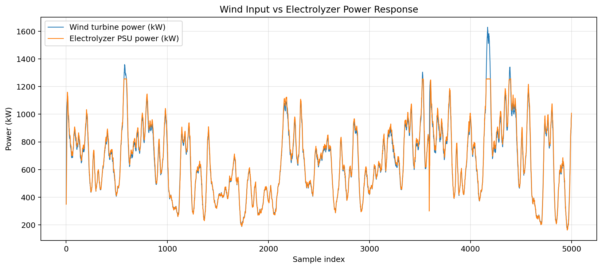
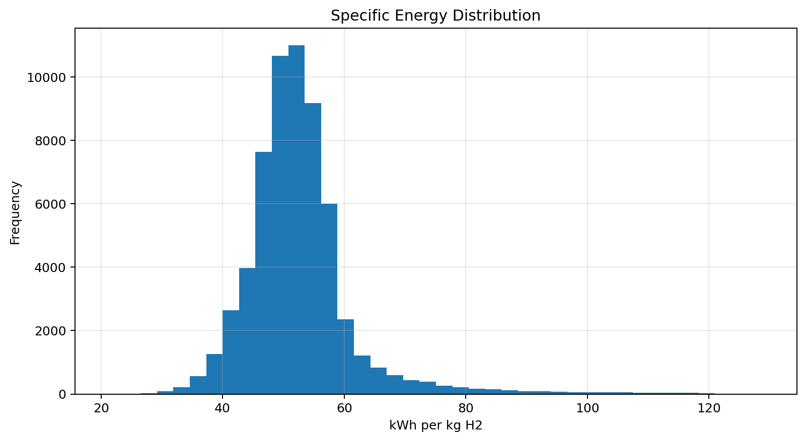
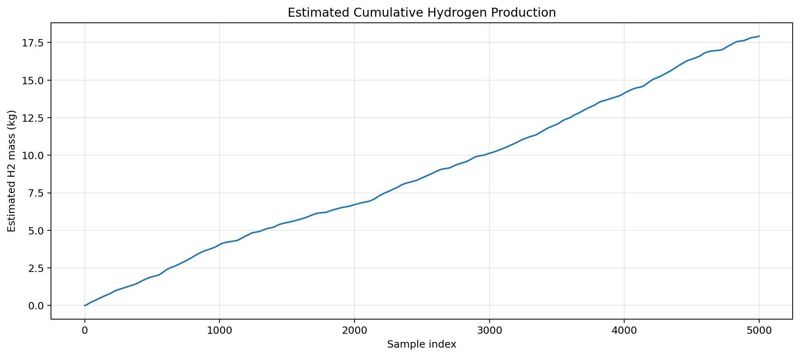

# Green Hydrogen Lab Data Analysis Dashboard

Python portfolio project analyzing public **megawatt-scale hydrogen electrolysis** data.

## Dashboard Preview

[Open the full live dashboard](https://pratikop.github.io/Green-hydrogen-lab-data-dashboard/)








## Dataset

Public Reference Data for Megawatt-Scale Hydrogen Electrolysis, NLR Submission 305:  
https://data.nlr.gov/submissions/305

The project uses `combined_wind_experiments.csv`, a public combined dataset from simulated wind experiments.

## Requirements

- Python
- pandas, NumPy, matplotlib
- CSV time-series data cleaning
- hydrogen/electrolyzer KPI calculation
- energy-efficiency analysis
- visualization
- dashboard-style reporting
- structured documentation for R&D workflows

## can also be Run on Google Colab

Open:

`notebooks/Green_Hydrogen_Lab_Data_Analysis_Dashboard_Colab.ipynb`

## Run locally

```bash
pip install -r requirements.txt
python src/run_dashboard.py --input data/raw/combined_wind_experiments.csv
```

## Outputs

- `data/processed/cleaned_green_hydrogen_lab_data.csv`
- `outputs/reports/kpis.json`
- `outputs/reports/analysis_report.md`
- `outputs/reports/dashboard.html`
- `outputs/reports/experiment_summary.csv`
- figures in `outputs/figures/`

## Final Result

Developed a Python-based green hydrogen lab data analysis dashboard using public megawatt-scale electrolysis data; cleaned and validated CSV time-series data, calculated hydrogen production and energy-efficiency KPIs, visualized operational trends with matplotlib, and documented the analysis pipeline for reproducible R&D reporting.
